#  Курсовая работа на профессии "DevOps-инженер с нуля" Дедяхин Игорь

## Файлы [Terraform](/terraform/)

## Файлы [Ansible](/ansible/)

## Grafana, Kibana [ip адреса](pub_ip.txt) 

### Схема инфраструктуры:

# Создание инфраструктуры в Яндекс Клауд с использованием Terraform.

Файл [network.tf](/terraform/network.tf) содержит конфигурацию сетевых компонентов:

- Сеть "project_net", подсети "project_a" и "project_b" расположенных в разных зонах "ru-central1-a" и "ru-central1-b". 
- Шлюз и сетевой маршрут для выхода ВМ, не имеющих публичных IP-адресов, в интернет.
- Группы безопасности для ВМ. Группа LAN позволяет ВМ работать в сети без каких либо ограничений, но только в подсети 10.0.0.0/8.  Группы "bastion", "grafana", "kibana" ограничивают доступ к соответствующим ВМ, доступ возможен только по портам, которые прослушивают сервисы ( доступ к "bastion" только по порту 22, к "kibana" только по порту 5601, к "grafana" только по порту 3000 )

Файл [balancer.tf](/terraform/balancer.tf) содержит описание Target group, с включеннымим в неё web-серверами, Backend group , HTTP router и Application load balancer. Настроен healthcheck.

В файле [vms.tf](/terraform/vms.tf) определены ВМ: "bastion", "web_1", "web_2", "prometheus_vm", "grafana_vm", "elasticsearch_vm", "kibana_vm". Описаны подсети в которых они будут работать, железо, ОС,  назначены группы безопасности. Файл так же содержит контсрукцию, позволяющую после создания инфрастурктуры записать в файл [hosts.ini](/ansible/hosts.ini) ip созданных ВМ, позже этот файл будет выполнять роль inventory-файла для ansible.

В файле [snapshot.tf](/terraform/snapshot.tf) описона порядок создания  snapshot дисков всех ВМ.

# Демонстрация работы Terraform

Terraform отработал без ошибок:

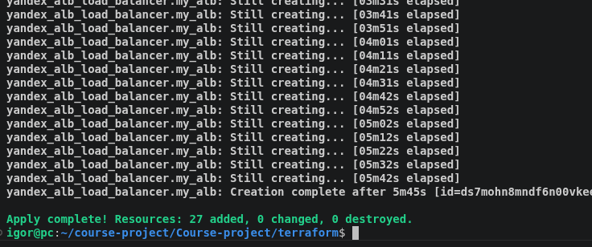

Созданы все необхдимые ВМ:

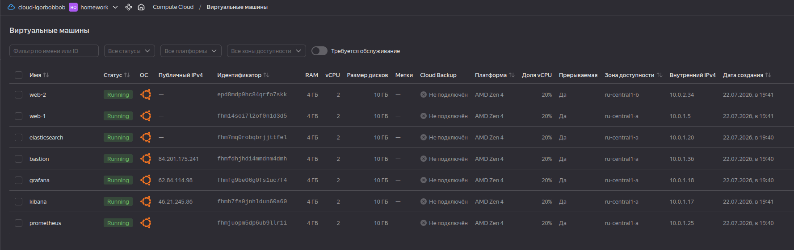

Создан сеть, подсеть и таблица маршрутизации:

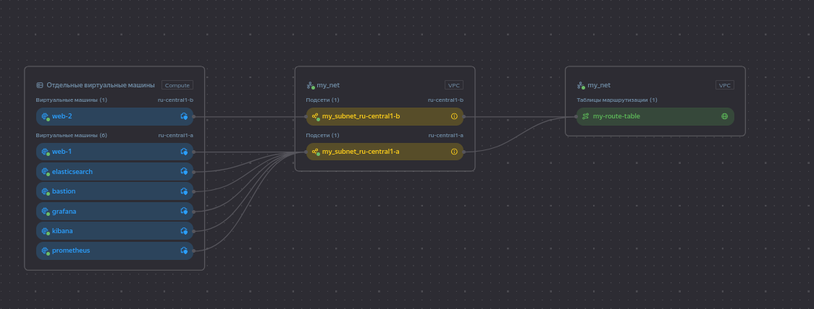

Создано расписание создания снимков дисков:

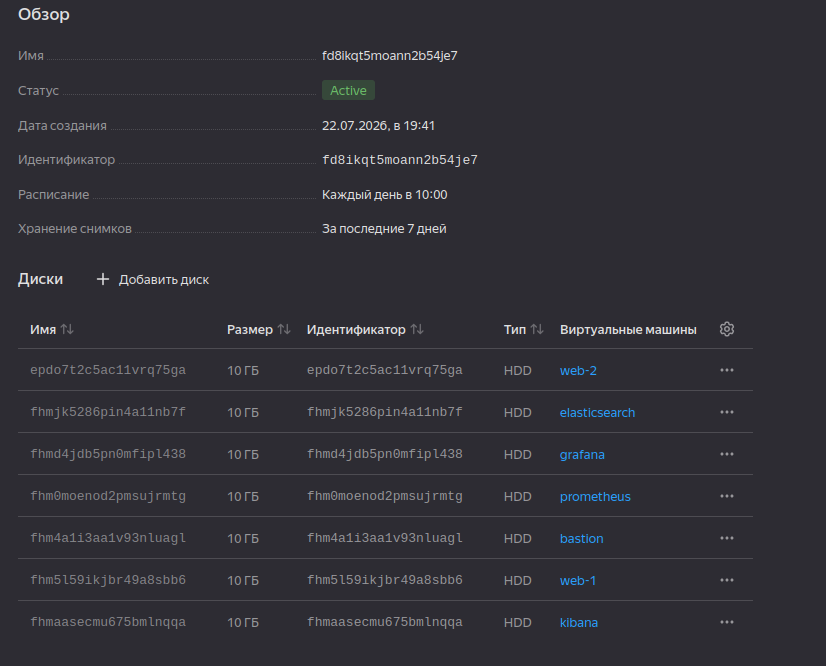

Создан балансировщик, HTTP роутер, группа бэкендов, целевая группа:

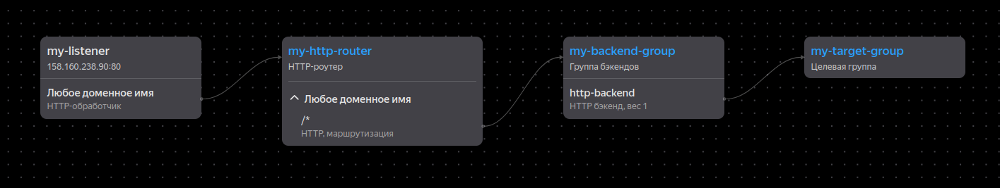

Проверка состояния (статус UNHEALTHY, т.к. nginx пока не установлен):

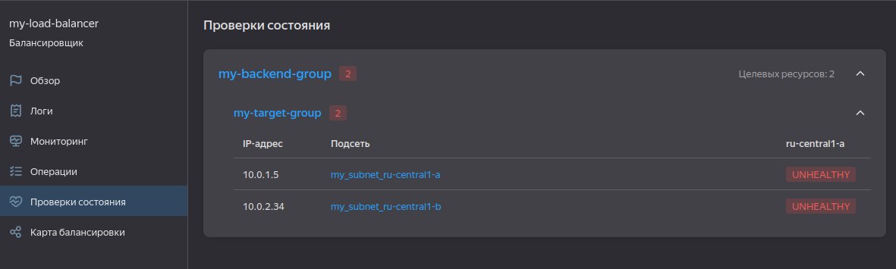

Созданы группы безопасности:

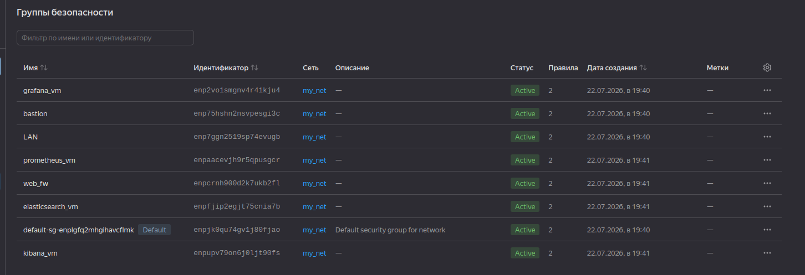

Всё готово к конфигурированию ВМ с помощью Ansble.

# Конфигурирование ВМ с использованием Ansible.

Файлы для конфигурации логически разбиты на роли: [elasticsearch](/ansible/roles/elasticsearch), [filebeat](/ansible/roles/filebeat), [grafana](/ansible/roles/grafana), [kibana](/ansible/roles/kibana), [nginx](/ansible/roles/nginx), [nginx_log_exporter](/ansible/roles/nginx_log_exporter), [node_exporter](/ansible/roles/node_exporter), [prometheus](/ansible/roles/prometheus)

Роли содержат необходимые задания, обработчики, файлы конфигурации и шаблоны j2.
Необходимые ip после завершения работы terraform внесены в файл [hosts.ini](/ansible/hosts.ini)
Подключение по ssh к ВМ осуществляется через bastion-сервер.

# Демонстрация работы Ansible

## Web-сервера

Плейбук nginx.yml  устанвливает и настраивает  nginx, заменяет стартовую страницу. 

Ansible отработал без ошибок:

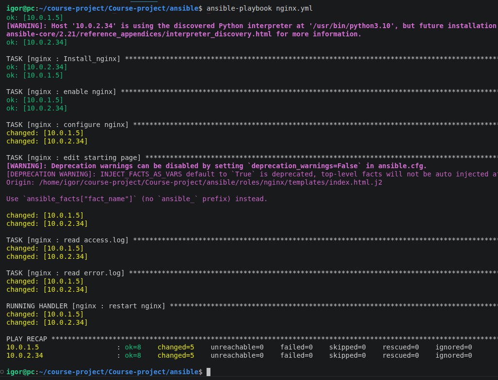

На web-сервере работает nginx, прослушивается порт 80:

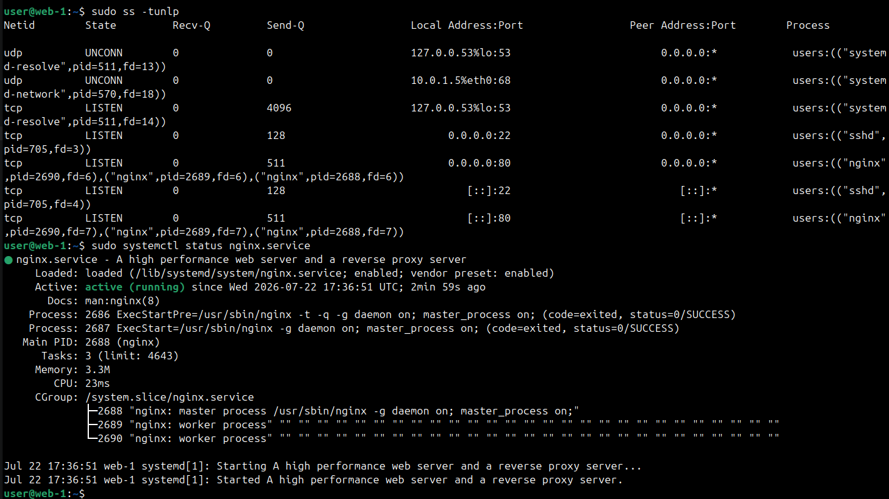

В барузере по адресу балансировщика види стартовую страницу с одного и второго сервера. Балансировщик работает!

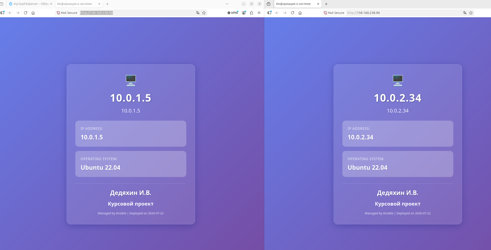

Cтатус сменился на HEALTHY.

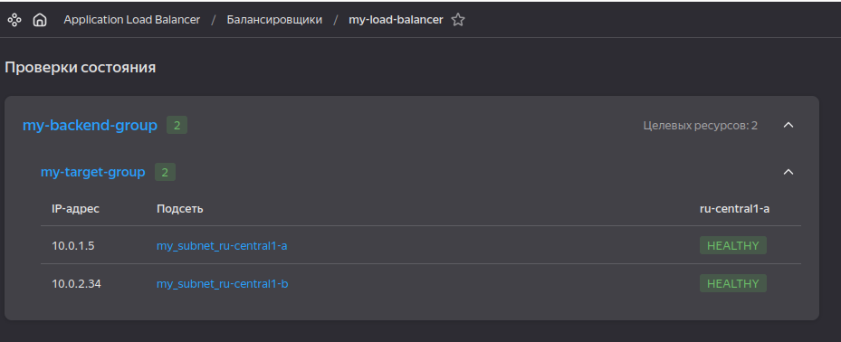

